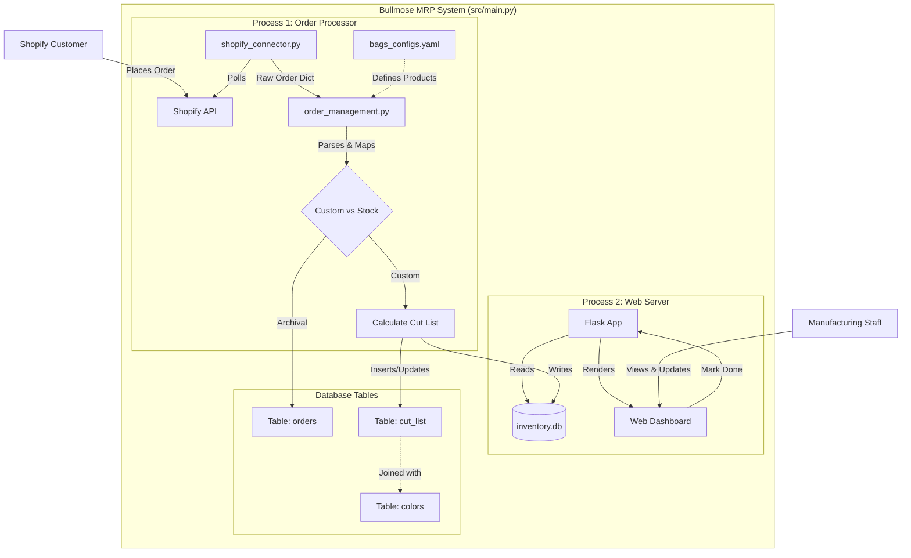

# Data Flow Documentation

This document outlines the data flow of the Bullmose Order Management System (MRP), detailing how data moves from external sources (Shopify), through the internal processing logic, into storage, and finally to the user interface.

## System Overview

The system runs as a multi-process Python application (`src/main.py`) that handles two main responsibilities concurrently:
1.  **Order Processing**: Continuously fetching and processing orders from Shopify.
2.  **Web Interface**: Serving a local web dashboard for manufacturing teams to view and manage cut lists.

## Architecture Components

*   **Entry Point**: `src/main.py` - Orchestrates the multiprocessing setup.
*   **Inventory & Config**:
    *   `src/bags_configs.yaml`: Defines product specifications (Bags, Panels, Hardware).
    *   `src/colors.yaml`: Defines available colors and hex codes.
    *   `inventory.db`: SQLite database storing all state (orders, cut lists, inventory).
*   **Connectors**:
    *   `src/shopify_connector.py`: Handles Shopify Admin API interactions.
    *   `src/db_connector.py`: Abstraction layer for all SQLite operations.
*   **Logic**:
    *   `src/order_management.py`: Business logic for converting Shopify orders into manufacturing tasks (Cut Lists).
    *   `src/bags.py`: Data models (`Bag`, `Panel`) and YAML parsing logic.

## Detailed Data Flow

### 1. Ingestion (Shopify -> System)
*   **Source**: Shopify Admin API.
*   **Trigger**: `run_order_processing` loop in `main.py` queries Shopify every `QUERY_INTERVAL` seconds.
*   **Action**: `shopify_connector.get_shopify_orders` requests unfulfilled orders.
*   **Data**: Raw JSON order data is converted to a simplified dictionary format.

### 2. Processing (Order -> Cut List)
Once an order is fetched:
1.  **Archival**: The raw order data is serialized to YAML and stored in the `orders` table of `inventory.db` to prevent duplicate processing.
2.  **Parsing**: `OrderManager.add_order` (in `src/order_management.py`) iterates through line items.
3.  **Classification**:
    *   **Custom Orders**: Validated by checking for "Color Set: Custom" property.
    *   **Ready to Ship**: (Logic partially implemented/stubbed).
4.  **Translation**:
    *   The system looks up the product definition in `src/bags_configs.yaml` using the product title.
    *   **Fuzzy Matching**: A robust matching logic (case-insensitive + whitespace stripping) attempts to map Shopify Product Titles (e.g., "Basket Boss ") to internal Config Names ("Basket Boss").
    *   **Property Parsing**: The system handles Shopify's property format (dictionary or list) to extract options like "Main Color".
    *   It maps these Shopify line item properties to specific Panels and RollGoods defined in the Bag configuration.
5.  **Output**: Data is decomposed via `Bag.generate_cut_list` into granular `cutLineItem` objects (Panel Name, File Path, Color, Quantity).

### 3. Storage (Memory -> Database)
*   **Component**: `src/db_connector.py`
*   **Tables**:
    *   `cut_list`: Stores the manufacturing queue.
    *   `colors`: normalized color names and IDs.
    *   `logs`: System logs.
*   **Action**: The calculated cut items are inserted into the `cut_list` table. If an identical item (same part, color, file) exists, its quantity is incremented.

### 4. Presentation (Database -> Web UI)
*   **Server**: Flask app running in `run_flask_server` (`src/main.py`).
*   **Read**:
    *   `cutting()` route queries `inventory.db` via `MRPDatabase.get_cut_list()`.
    *   Optional `color` query parameter filters the results.
    *   The view aggregates identical panels (same name, color, file) to show a consolidated "To Cut" count.
*   **Render**: `templates/cutting.html` displays the table of items to be cut.
*   **Filtering**: user can filter the cut list by color to optimize for single-roll cutting.
*   **Update**:
    *   User clicks "Done" on the UI.
    *   POST request to `/mark_done/<id>`.
    *   Database updates the row's status to 'done'.

## System Diagram (Mermaid)

## Key Configuration Files

*   **`src/bags_configs.yaml`**: The source of truth for product mapping. It must match the product titles and Option names in Shopify for the mapping logic to work.
*   **`.env`**: Contains sensitive API keys (`SHOPIFY_ACCESS_TOKEN`, `SHOPIFY_SHOP_URL`).

## Logic Flows

**How a Shopify Property becomes a physical cut:**
1.  Shopify Line Item Property: `{"name": "Main Panel", "value": "Black VX21"}`
2.  Bag Config: `fabric_panels` list has a panel with `shop_map: "Main Panel"`.
3.  Logic: System maps "Black VX21" (Value) to the panel defined by "Main Panel" (Key).
4.  Result: A cut list entry for "Back Panel" (internal name) in color "Black VX21".
