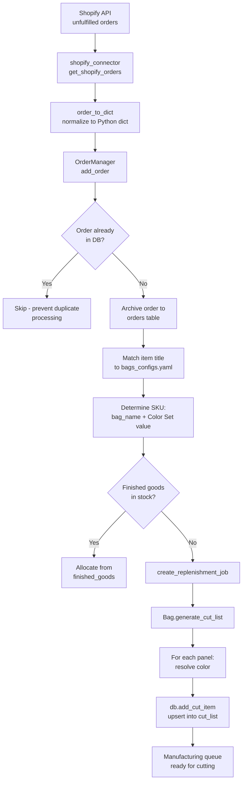
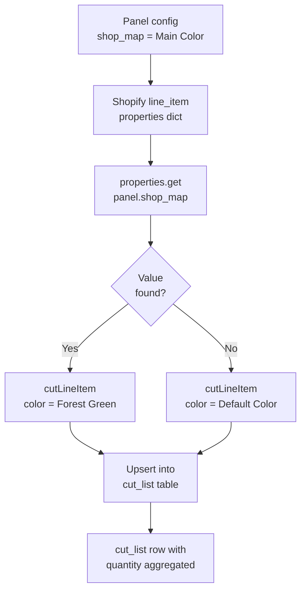
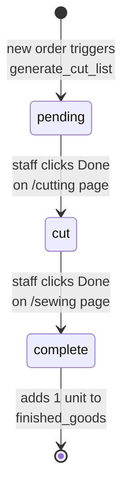

# Data Flow Documentation: Bullmose MRP System

## System Overview

Bullmose is a two-process Python application that converts custom Shopify orders into a granular fabric **cut list** organized by color. Process 1 runs an order processor that polls Shopify, parses orders, and writes manufacturing tasks to SQLite. Process 2 runs a Flask web server that reads those tasks and presents them to manufacturing staff. The primary output is a cutting queue filtered by color, allowing staff to cut all panels from a single fabric roll before moving to the next color.

---

## Part 1: Data Inputs

### 1a. Custom Color Orders

When a customer selects **`Color Set: Custom`**, they specify each panel's color as a separate Shopify order property. The property name must exactly match that panel's `shop_map` value in `bags_configs.yaml`.

**Example: Order #1254 (B.O.F.P bag)**

```yaml
id: 6751598051555
name: '#1254'
line_items:
- title: B.O.F.P
  quantity: 1
  properties:
  - name: Color Set
    value: Custom
  - name: Main Color
    value: Forest Green
  - name: Accent 1 (optional)
    value: Cheetah
  - name: Accent 2 (optional)
    value: Pink
  - name: Interior
    value: Neon Yellow
  - name: Strap Length
    value: '24"-48"'
```

**How it flows:**
- `properties` is a list of `{name, value}` dicts from Shopify API
- `shopify_connector.order_to_dict()` converts this to a keyed dict: `{"Color Set": "Custom", "Main Color": "Forest Green", "Accent 1 (optional)": "Cheetah", ...}`
- `Bag.generate_cut_list()` then calls `properties.get(panel.shop_map)` for each panel
- **Critical detail:** Shopify property names often include labels like `"(optional)"`, but `shop_map` values in the bag config don't. If they don't match exactly, the lookup returns `None` → the system falls back to `"Default Color"`.

### 1b. Preset Color Orders

When a customer selects **`Color Set: [preset name]`** like `"Navy/Green/Yellow"`, the slash-delimited string is stored as part of the SKU for readability. However, the cutting logic doesn't parse the slash string. Instead, the Shopify storefront must still set individual named properties matching the panel's `shop_map` keys.

**How `color_order_map` works:**
The `color_order_map` field in the bag config defines the *position* of each color in the slash-separated string, but only as documentation/reference. For example:

```yaml
bag:
  name: "B.O.F.P"
  color_order_map: ["Main Color", "Accent 1", "Accent 2", "Interior"]
```

This means: "If the customer enters a slash-delimited preset, the 1st color is for Main, 2nd for Accent 1," etc. However, `Bag.generate_cut_list()` still uses `properties.get(panel.shop_map)` to resolve each panel's color—it does not call `explode_standard_colors()` to parse the slash string. The Shopify storefront is responsible for setting individual properties.

---

## Part 2: Configuration Source of Truth

**File:** `src/bags_configs.yaml`

This YAML file defines all product specifications. Each bag is a YAML document (separated by `---`) with this structure:

```yaml
---
bag:
  name: "B.O.F.P"
  inventory_policy: {min_stock: 5, batch_size: 1}
  color_order_map: ["Main Color", "Accent 1", "Accent 2", "Interior"]
  
  fabric_panels:
    - name: "Back Panel"                # Human-readable panel name
      shop_map: "Main Color"            # Shopify property key this panel reads from
      file_path: "back_panel.svg"       # SVG file for cutting
      material_set: "Default Fabric"    # Material category
    
    - name: "Side Panel"
      shop_map: "Accent 1"
      file_path: "side_panel.svg"
      material_set: "Default Fabric"
    
    - name: "Top Panel"
      shop_map: "Accent 2"
      file_path: "top_panel.svg"
      material_set: "Default Fabric"
    
    - name: "Interior"
      shop_map: "Interior"
      file_path: "interior.svg"
      material_set: "Default Fabric"
  
  hardware:
    - name: "Front Buckle"
      size: 4
      color: "Black"
  
  roll_goods:
    - name: "Adjustable Strap"
      shop_map: "Adjustable Strap"  # Shopify property key
      len: 120                       # Length in mm
      material_set: "Navy 25mm"      # Fallback if property not found
      quantity: 1                    # Units per bag
```

**Key fields:**
- **`name`**: Must match Shopify product title (case and whitespace-insensitive)
- **`color_order_map`**: Documents the positional order of slash-delimited colors (reference only; not used in cut generation)
- **`shop_map`**: The Shopify property name that holds the color for this panel/roll-good
- **`file_path`**: SVG filename used by the cutter
- **`material_set`**: Fallback value if the Shopify property is missing

---

## Part 3: The Color Resolution Pipeline

### Full Data Flow (Mermaid)



### Per-Panel Color Resolution (Mermaid)



**Key logic:**
1. For each panel in the bag definition, `generate_cut_list()` calls `properties.get(panel.shop_map)`
2. If the value exists, it becomes the panel's color in the cut list
3. If the value is missing (e.g., due to property name mismatch), it falls back to `"Default Color"` or the panel's `material_set`
4. Both "Custom" and "Preset" color modes use the same resolution path—the difference is only in SKU construction

---

## Part 4: Database Output Schema

### The `cut_list` Table (Primary Manufacturing Output)

This is the real output: a granular queue of fabric panels to cut, organized by color.

| Column | Type | Notes |
|--------|------|-------|
| `id` | INTEGER PRIMARY KEY | Auto-incremented |
| `panel_name` | TEXT | e.g., `"Back Panel"`, `"Adjustable Strap"` |
| `file_path` | TEXT | SVG filename (e.g., `"back_panel.svg"`), or `"-"` for roll goods |
| `color` | TEXT | e.g., `"Forest Green"`, `"Cheetah"` |
| `quantity` | INTEGER | Aggregated count across all orders |
| `status` | TEXT | `"pending"` (status transitions incomplete) |
| `created_at` | TIMESTAMP | Row creation time |

**Upsert constraint:** `UNIQUE(panel_name, file_path, color, status)`

When multiple orders call for the same panel in the same color, the `quantity` column increments rather than creating duplicate rows. This aggregation is what allows the cutter to batch all work for a given color.

### The `jobs` Table (Bag-Level Work Orders)

Tracks manufacturing jobs at the bag level (separate from panel-level granularity).

| Column | Type | Notes |
|--------|------|-------|
| `job_id` | INTEGER PRIMARY KEY | Auto-incremented |
| `sku` | TEXT | e.g., `"B.O.F.P - Custom"`, `"Basket Boss - Navy/Green"` |
| `status` | TEXT | `"pending"` → `"cut"` → `"complete"` |
| `batch_id` | TEXT | Groups related replenishment runs |
| `created_at` | TIMESTAMP | Job creation time |

**Distinction:**
- `cut_list` = detailed panel-by-panel cutting instructions
- `jobs` = whole-bag manufacturing progress tracking

---

## Part 5: Web UI and Manufacturing Workflow

### Routes and State Transitions

| Route | Method | Purpose |
|-------|--------|---------|
| `/cutting` | GET | Shows all pending cut items, grouped by panel/color |
| `/cutting?color=Forest+Green` | GET | Filtered view for one color (to match a single fabric roll) |
| `/api/mark_cut/<job_id>` | POST | Updates job status: `pending` → `cut` |
| `/sewing` | GET | Shows jobs with status `"cut"`, ready for final assembly |
| `/api/mark_sewn/<job_id>` | POST | Updates job status: `cut` → `complete`, adds to `finished_goods` |

**Note:** The "Done" button in the `/cutting` template (cutting.html) is currently disabled. Status updates are managed at the job level (`/api/mark_cut` and `/api/mark_sewn`), not at the individual cut_list item level.

### Manufacturing Workflow (State Diagram)



### Color-Filtered Cutting Workflow (Efficiency)

The system is designed so staff can minimize fabric waste:

1. Staff navigates to `/cutting?color=Forest+Green`
2. Sees all panels that need to be cut in Forest Green
3. Pulls the Forest Green fabric roll
4. Cuts all listed panels from a single roll
5. Marks job as cut → moves to sewing queue
6. Returns to `/cutting` and selects the next color

This avoids switching between fabric rolls mid-operation.

---

## Part 6: End-to-End Example: Order #1254

**Raw Shopify order arrives:**
```yaml
id: 6751598051555
line_items:
- title: B.O.F.P
  quantity: 1
  properties:
  - name: Color Set
    value: Custom
  - name: Main Color
    value: Forest Green
  - name: Accent 1 (optional)
    value: Cheetah
  - name: Accent 2 (optional)
    value: Pink
  - name: Interior
    value: Neon Yellow
```

**Step 1: Normalization**
`order_to_dict()` converts the properties list to a keyed dict:
```python
{
  "Color Set": "Custom",
  "Main Color": "Forest Green",
  "Accent 1 (optional)": "Cheetah",
  "Accent 2 (optional)": "Pink",
  "Interior": "Neon Yellow",
  ...
}
```

**Step 2: SKU Determination**
```python
sku = "B.O.F.P - Custom"  # from bag name + Color Set value
```

**Step 3: Inventory Check**
```python
finished_goods_count("B.O.F.P - Custom") = 0  # No stock
→ Proceed to generate_cut_list
```

**Step 4: Cut List Generation**
For each panel in the B.O.F.P bag config:

| Panel Name | shop_map | properties.get(shop_map) | Status |
|--------|----------|--------------------------|--------|
| Back Panel | Main Color | Forest Green | ✓ |
| Side Panel | Accent 1 | None → "Default Color" | ⚠️ Mismatch |
| Top Panel | Accent 2 | None → "Default Color" | ⚠️ Mismatch |
| Interior | Interior | Neon Yellow | ✓ |

**⚠️ Known Issue:** The Shopify properties are named `"Accent 1 (optional)"` and `"Accent 2 (optional)"`, but the bag config expects `"Accent 1"` and `"Accent 2"`. The lookup fails, and these panels default to `"Default Color"`.

**Step 5: Upsert into `cut_list` Table**
```
INSERT OR IGNORE INTO cut_list (panel_name, file_path, color, status, ...)
  VALUES ('Back Panel', 'back_panel.svg', 'Forest Green', 'pending', ...);
UPDATE cut_list SET quantity = quantity + 1
  WHERE panel_name='Back Panel' AND file_path='back_panel.svg' 
  AND color='Forest Green' AND status='pending';
```

**Step 6: Manufacturing Display**
Staff views `/cutting?color=Forest+Green` and sees:

| Panel Name | Color | File | Quantity |
|--------|-------|------|----------|
| Back Panel | Forest Green | back_panel.svg | 1 |

---

## Part 7: Key Files Reference

| File | Role | When Adding a New Bag |
|------|------|----------------------|
| `src/bags_configs.yaml` | Product catalog (source of truth) | Add new YAML document with bag definition |
| `src/bags.py` | `Bag`, `Panel`, `cutLineItem` dataclasses + `generate_cut_list()` logic | Usually no change needed |
| `src/order_management.py` | Business logic: dedup, inventory checks, dispatch to `generate_cut_list` | Usually no change needed |
| `src/shopify_connector.py` | Shopify API polling + `order_to_dict()` normalization | Usually no change needed |
| `src/db_connector.py` | SQLite operations (cut_list, jobs, orders, finished_goods tables) | Usually no change needed |
| `src/main.py` | Flask routes (`/cutting`, `/sewing`, `/api/mark_cut`, etc.) + multiprocessing entry | Usually no change needed |

---

## Part 8: Deployment

### Container Image

The production image is defined in [Dockerfile.pi](Dockerfile.pi) — a minimal `python:3.10-slim` image that copies only `src/` and `templates/`, installs requirements, and runs as a non-root user (`appuser`).

On every push to `main`, GitHub Actions builds a **multi-arch manifest** and pushes to GHCR:

```
ghcr.io/nikolaasbender/mrp_mongoose:latest
ghcr.io/nikolaasbender/mrp_mongoose:<git-sha>
```

Supported architectures:

| Platform | Target |
|---|---|
| `linux/amd64` | x86 dev/server |
| `linux/arm/v7` | Raspberry Pi 2/3 |
| `linux/arm/v8` | Raspberry Pi 3 (64-bit) |
| `linux/arm64` | Raspberry Pi 4/5 |

Docker automatically selects the correct layer on pull — no arch-specific tags needed.

Workflow file: [.github/workflows/build-pi.yml](.github/workflows/build-pi.yml)

### Raspberry Pi Setup

Copy [docker-compose.pi.yml](docker-compose.pi.yml) and a `.env` file to the Pi, then run once:

```bash
# Login to GHCR (PAT needs read:packages scope)
echo YOUR_PAT | docker login ghcr.io -u NikolaasBender --password-stdin

# Start app + Watchtower
docker compose -f docker-compose.pi.yml up -d
```

**Watchtower** polls GHCR every 5 minutes and auto-updates the `app` container when a new `:latest` image is available. Old images are cleaned up automatically (`--cleanup` flag).

### Data Persistence

The database is volume-mounted at `app_data:/app/data` so it survives container updates. Config files are bind-mounted from `~/.config/mrp_mongoose` on the host.

---

## Critical Implementation Notes

1. **Property Name Matching:** Shopify property names must exactly match panel `shop_map` values. If they don't, lookups fail silently and revert to `"Default Color"`.

2. **No Slash-String Parsing:** The `Bag.explode_standard_colors()` method exists but is not wired into the processing pipeline. Preset colors still require individual Shopify properties to be set.

3. **Cut-List Item Status:** Individual cut_list rows remain `"pending"` indefinitely. The manufacturing status workflow operates at the job level, not the item level. This is a known gap in the implementation.

4. **Inventory Aggregation:** The upsert constraint ensures identical panels (same name, color, file) accumulate quantities rather than creating duplicates. This is essential for efficient cutting.
